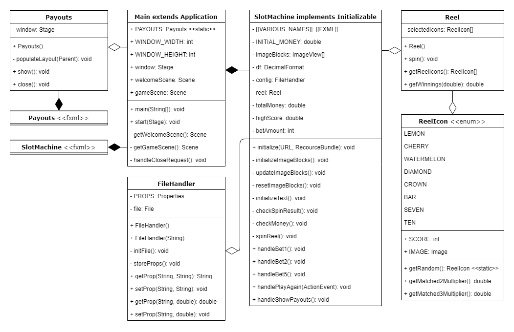
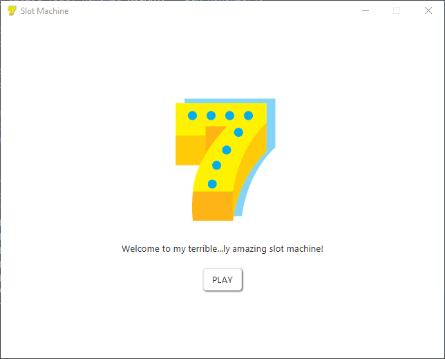
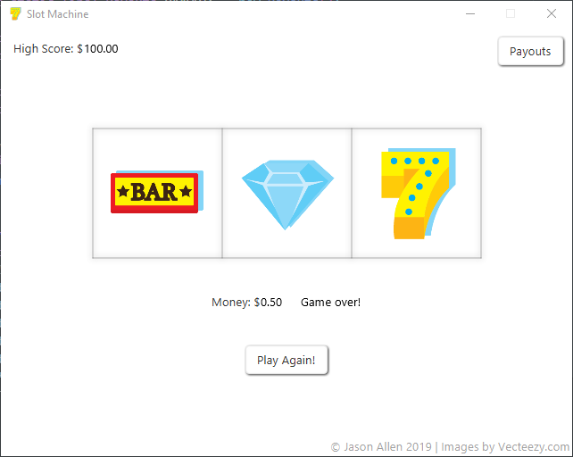

SlotMachineFX
=============

A simple Java slot machine game developed with
[VSCode](https://code.visualstudio.com/) and
[SceneBuilder](https://gluonhq.com/products/scene-builder/),
using [JavaFX 12](https://openjfx.io/) as a GUI library.

| Table of Contents                |
| -------------------------------- |
| [1. Usage](#usage)               |
| [2. Outline](#outline)           |
| [3. UML Diagram](#uml-diagram)   |
| [4. GUI Examples](#gui-examples) |

## Usage

To run or debug this program, download and extract the
[JavaFX 12 SDK](https://gluonhq.com/products/javafx/) and point to the
JavaFX SDK `lib` directory in the module path in VSCode's launch configuration:

> .vscode/launch.json

```json
{
  "type": "java",
  "name": "SlotMachine",
  "request": "launch",
  "mainClass": "slotmachine.Main",
  "projectName": "SlotMachineFX",
  "vmArgs": "--module-path C:\\javafx-sdk-12.0.1\\lib\\ --add-modules javafx.controls,javafx.fxml"
}
```

You will also need to edit the `.classpath` file to point to the JavaFX SDK libraries:

> .classpath

```xml
<classpathentry kind="lib" path="C:\javafx-sdk-12.0.1\lib\javafx.base.jar"/>
<classpathentry kind="lib" path="C:\javafx-sdk-12.0.1\lib\javafx.graphics.jar"/>
<classpathentry kind="lib" path="C:\javafx-sdk-12.0.1\lib\javafx.controls.jar"/>
<classpathentry kind="lib" path="C:\javafx-sdk-12.0.1\lib\javafx.fxml.jar"/>
```

You should now be able to run and debug using VSCode's CodeLens or debugger!

## Outline

Create a JavaFX slot machine GUI with a predetermined starting cash,
have buttons for the user to click and gamble with, give the user a return on
average which is slightly lower than 100% so that while they should win and have
their money go up, it should normally always reach game over after a while.

### Details

Create a welcome window as a splash screen for when you open the game, then
load the main game window with some default images.

When the user clicks on a bet button, bet that amount of money and spin the
slot machine reels. Based on how many matches of a certain icon, return a set
multiplier on their bet so that they either win a multiplier of their bet, or
lose all of their bet.

If money is too low for a certain bet, disable that button.

If the users money is lower than the smallest bet, display game over and
play again allowing the user to restart.

Save the user's high score to add a point of comparison while playing.
Write the high score to file to persist across multiple game sessions.

Add a button to display a payouts window displays all the possible matches and
their respective payout multipliers.

## UML Diagram



## GUI Examples

> Splash Screen



> Game Window


> Play Again



> Payouts


